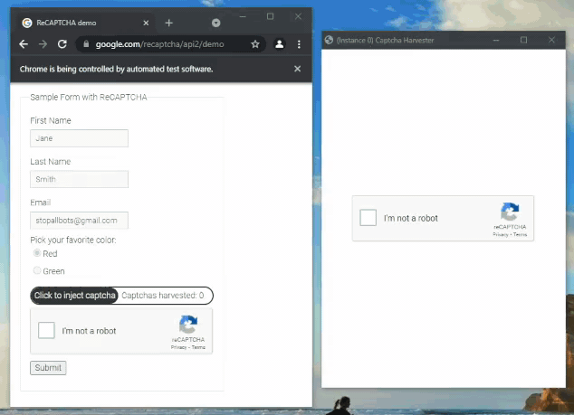

<h1 align="center">Captcha Harvester</h1>
<p align="center">Solve captcha beforehand and use them when needed.</p>
<p align="center"></p>


## Introduction

### What is captcha harvester?

Captcha harvester is a tool to solve captchas yourself, store them, and evantually use when you need them in your automation software / bot.

### Example use case

Bot to buy limited products. When your bot is at checkout, you don't have to solve captcha, you can solve it before and inject solved captcha when it needed. It gives you advanatge of extra couple seconds.

### How does captcha harvester work?

Harvester is instance of automated browser window. Harvester opens website you want to harvest captchas on. HTML is changed to blank HTML document with just captcha box in it. Captcha is rendered and you can solve captchas. When you solve captcha, captcha response is stored in response queue and captcha box is reseted so you can solve more captchas. When captcha response is needed in your automation software / bot it can be pulled from response queue and used.

There is a HarvesterManager class that is managing all Harvesters, when main_loop is ran, HarvesterManager is executing tick function in all Harvesters in infinite loop, all responses from queues in Harvesters are moved to single queue in HarvesterManager. Note that there is expiration time for every captcha solved. For reCAPTCHA v2 expiration time is 120 seconds counted from moment of successful captcha solve.

### Example of using captcha harvester

<p align="center"></p>

## Features

Captcha Harvester supports logging in to your Google account to lower captcha difficulty.

Harvester can run with additional window where Youtube videos will be viewed to make activity on your Google account to lower captcha difficulty. 

Sitekey can be scraped from website on which you want to harvsest captchas by executing get_sitekey method from Harvester class. 


## Compatibility

Captcha harvester was tested and working on Windows and Linux.

For now harvester is compatible with reCAPTCHA v2. In the future it will be compatible with reCAPTCHA v3, hCaptcha and others.

## Requirements

- Python 3
- All packages from requirements.txt
- Google Chrome

## Installation

- Download and install Python 3 from <a href="https://www.python.org/downloads/">here</a>.
- Install all packages from requirements.txt. In terminal type: `pip install -r requirements.txt` ( You need to be in same directory as requirements.txt or provide full path to requirements.txt. )
- Install Google Chrome from <a href="https://www.google.com/chrome/">here</a>.

## How to use

- Example code

    - In example.py is shown an example of a simple way to use harvester.
    
    ```
    url = 'https://www.google.com/recaptcha/api2/demo'
    sitekey = Harvester.get_sitekey(url)

    harvester_manager = HarvesterManger(response_callback=lambda x: print(x['response']))
    harvester_manager.add_harvester(Harvester(url, sitekey))
    harvester_manager.start_harvesters()
    harvester_manager.main_loop()
    ```
    - In example_bot.py is shown an example of connecting harvester with bot and sending solved captchas to it.
    
    ```
    url = 'https://www.google.com/recaptcha/api2/demo'
    sitekey = Harvester.get_sitekey(url)

    harvester_manager = HarvesterManger()
    harvester_manager.add_harvester(Harvester(url=url, sitekey=sitekey, log_in=True, open_youtube=True))
    harvester_manager.start_harvesters()

    bot = Bot(harvester_manager)
    bot.start(url=url)

    bot_loop_thread = Thread(target=bot.main_loop)
    harvester_manager_loop_thread = Thread(target=harvester_manager.main_loop)

    bot_loop_thread.start()
    harvester_manager_loop_thread.start()

    bot_loop_thread.join()
    harvester_manager_loop_thread.join()
    ```
    
    To run example code just run example.py or example_bot.py with python.
    
    Note that in example_bot.py Harvester is added with additional parameters, there are much more additional parameters ( look in Harvester class ).
    
    Note that you can add as many harvesters as you want ( Limit is only your computer specs ).
        
## TODO

-[x] **reCAPTCHA v2**
-[] **reCAPTCHA v3**
-[] **hCapctcha**

## LICENSE

```
MIT License

Copyright (c) 2022 Artur Brytkowski

Permission is hereby granted, free of charge, to any person obtaining a copy
of this software and associated documentation files (the "Software"), to deal
in the Software without restriction, including without limitation the rights
to use, copy, modify, merge, publish, distribute, sublicense, and/or sell
copies of the Software, and to permit persons to whom the Software is
furnished to do so, subject to the following conditions:

The above copyright notice and this permission notice shall be included in all
copies or substantial portions of the Software.

THE SOFTWARE IS PROVIDED "AS IS", WITHOUT WARRANTY OF ANY KIND, EXPRESS OR
IMPLIED, INCLUDING BUT NOT LIMITED TO THE WARRANTIES OF MERCHANTABILITY,
FITNESS FOR A PARTICULAR PURPOSE AND NONINFRINGEMENT. IN NO EVENT SHALL THE
AUTHORS OR COPYRIGHT HOLDERS BE LIABLE FOR ANY CLAIM, DAMAGES OR OTHER
LIABILITY, WHETHER IN AN ACTION OF CONTRACT, TORT OR OTHERWISE, ARISING FROM,
OUT OF OR IN CONNECTION WITH THE SOFTWARE OR THE USE OR OTHER DEALINGS IN THE
SOFTWARE.

```