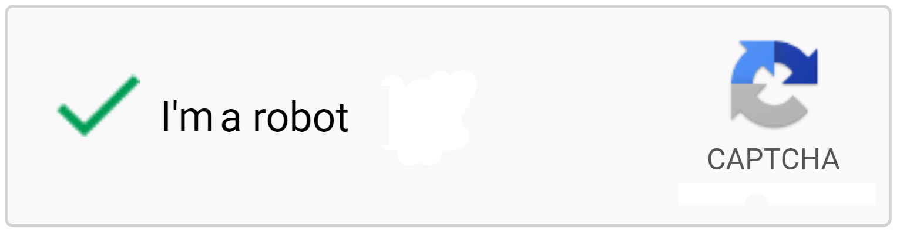

<h1 align="center">Captcha Harvester</h1>
<p align="center">Solve captcha beforehand and use them when needed.</p>
<p align="center"></p>


## Introduction

### What is captcha?

Captcha is a type of challenge–response test used in computing to determine whether the user is human.

For example reCAPTCHA v2 is task to select images that match description.

### What is captcha harvester?

Captcha harvester is a tool to solve captchas yourself, store solved captcha responses, and evantually use them when you need them in your automation software / bot.

### What is use case of captcha harvester

Bot to buy limited products. When your bot is at checkout, you don't have to solve captcha, you can solve it before and inject solved captcha response when it's needed. It gives you advanatge of extra couple seconds.

### Example of using captcha harvester

<p align="center"></p>

### How does captcha harvester work?

- Sitekey

    First we need to know what is a sitekey. Sitekey is a string that is linked to website that is identifying this website regarding captcha. Sitekey is needed to render captcha box. Note that if you will try to render captcha on website with sitekey that is not matching website it will fail. So we need two things: website url and website sitekey. Sitekey can be found in element with "g-recaptcha" class in "data-sitekey" tag or can be found in javascript like: 'sitekey' : 'some_sitekey'.
    
- Captcha response

    Next we need to understand what determines if captcha is solved. When captcha is solved inside element with id "g-recaptcha-response" will be long string: it is called captcha response. Now we can copy that string, and when we need to submit some form where captcha is needed to be solved, we can inject it inside same element and submit form.

- Harvester

    Harvester is instance of automated browser window. Harvester opens website you want to harvest captchas on. HTML is changed to blank HTML document with just captcha box in it. Captcha is rendered and you can solve captchas. When you solve captcha, captcha response is stored in response queue and captcha box is reseted so you can solve more captchas. When captcha response is needed in your automation software / bot it can be pulled from response queue and used.

- HarvesterManager

    There is a HarvesterManager class that is managing all Harvesters, when main_loop is called, HarvesterManager is executing tick function in all Harvesters in infinite loop, all responses from queues in Harvesters are moved to single queue in HarvesterManager. Note that there is expiration time for every captcha solved. For reCAPTCHA v2 expiration time is 120 seconds counted from moment of successful captcha solve.

## Features

Captcha Harvester supports logging in to your Google account to lower captcha difficulty.

Harvester can run with additional window where Youtube videos will be played to make activity on your Google account to lower captcha difficulty. 

Sitekey can be scraped from website on which you want to harvsest captchas by executing get_sitekey method from Harvester class. 

You can use proxy for captcha harvesting (proxies with or without authentication). NOTE. You need to use good proxies, free proxies found on the web in 95% of the time will not work and will timeout. NOTE. Sometimes when you use proxy with authentication, login window will not close automatically, you need just to close it manually, in future I will try to fix it.

## Compatibility

Captcha harvester was tested and working on Windows and Linux.

For now harvester is compatible with reCAPTCHA v2. In the future it will be compatible with reCAPTCHA v3, hCaptcha and others.

## Requirements

- Python 3
- All packages from requirements.txt
- Google Chrome

## How to install

- Download and install Python 3 from <a href="https://www.python.org/downloads/">here</a>.
- Install all packages from requirements.txt. In terminal type: `pip install -r requirements.txt` ( You need to be in same directory as requirements.txt or provide full path to requirements.txt. )
- Install Google Chrome from <a href="https://www.google.com/chrome/">here</a>.

## How to use

- Example code

    - In <a href="example.py">example.py</a> is shown an example of a simple way to use harvester. To run type in terminal <b>python example.py</b>
    - In <a href="example_bot.py">example_bot.py</a> is shown an example of connecting harvester with bot and sending solved captcha responses to it. To run type in terminal <b>python example_bot.py</b>
            
## TODO

- [x] **Proxy support**
- [x] **reCAPTCHA v2 compatibility**
- [ ] **reCAPTCHA v3 compatibility**
- [ ] **hCapctcha compatibility**
- [ ] **captcha harvester as package**
- [ ] **captcha harvester installed with pip**
- [ ] **API integration**

## License

```
MIT License

Copyright (c) 2022 Artur Brytkowski

Permission is hereby granted, free of charge, to any person obtaining a copy
of this software and associated documentation files (the "Software"), to deal
in the Software without restriction, including without limitation the rights
to use, copy, modify, merge, publish, distribute, sublicense, and/or sell
copies of the Software, and to permit persons to whom the Software is
furnished to do so, subject to the following conditions:

The above copyright notice and this permission notice shall be included in all
copies or substantial portions of the Software.

THE SOFTWARE IS PROVIDED "AS IS", WITHOUT WARRANTY OF ANY KIND, EXPRESS OR
IMPLIED, INCLUDING BUT NOT LIMITED TO THE WARRANTIES OF MERCHANTABILITY,
FITNESS FOR A PARTICULAR PURPOSE AND NONINFRINGEMENT. IN NO EVENT SHALL THE
AUTHORS OR COPYRIGHT HOLDERS BE LIABLE FOR ANY CLAIM, DAMAGES OR OTHER
LIABILITY, WHETHER IN AN ACTION OF CONTRACT, TORT OR OTHERWISE, ARISING FROM,
OUT OF OR IN CONNECTION WITH THE SOFTWARE OR THE USE OR OTHER DEALINGS IN THE
SOFTWARE.
```